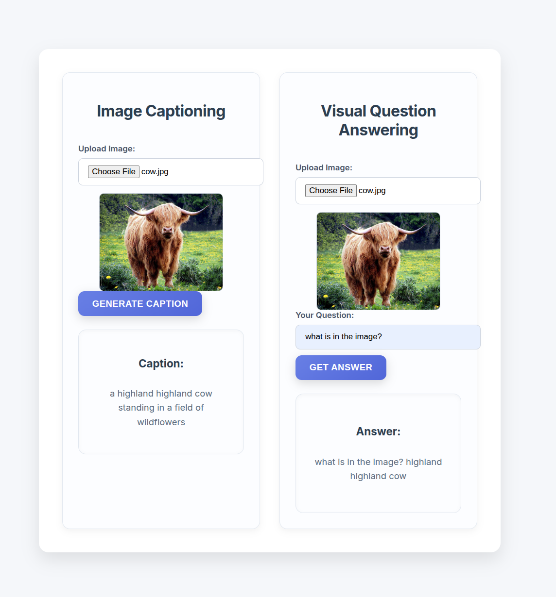

# BLIP (Bootstrapping Language-Image Pre-training)

## Introduction
BLIP is a framework for pre-training vision-language models that combines the strengths of both contrastive and generative approaches. It is designed to improve the performance of models on various vision-language tasks by leveraging large-scale datasets and advanced training techniques.

This application provides a user-friendly interface for testing and using BLIP models. It allows users to input images and text, and receive predictions based on the pre-trained models.

## Installation
To install the necessary dependencies, run the following command:
```bash
pip install -r requirements.txt
```
## Usage
To use the BLIP application, follow these steps:
1. Ensure you have the required dependencies installed.
2. Run the application using the command:
```bash
python main.py
```
3. Open your web browser and navigate to `http://127.0.0.1:8000` to access the application interface.
4. Upload an image and enter a text prompt to receive predictions from the BLIP model.

## Features
- **Image Input**: Upload images to be processed by the BLIP model.
- **Text Input**: Enter text prompts to guide the model's predictions.
- **Model Predictions**: Receive predictions based on the input image and text.
- **User-Friendly Interface**: Easy-to-use web interface for interacting with the model.

### Demo
This image shows the interface of the BLIP application where users can upload images and enter text prompts to receive predictions.

*Fig*: BLIP Application Interface